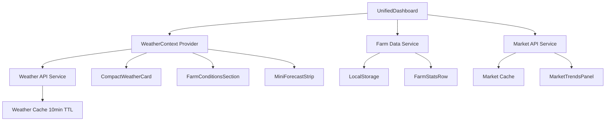

# Unified Smart Agriculture Dashboard - Design Document

## Overview

This design document outlines the technical architecture for integrating weather information directly into the FarmEase main dashboard, eliminating the standalone Weather page. The unified dashboard will provide farmers with a single, comprehensive view combining farm statistics, weather insights, actionable farming advice, alerts, and market trends.

### Design Goals

1. **Single Source of Truth**: Consolidate all essential farm information into one view
2. **Actionable Intelligence**: Transform raw weather data into farming decisions
3. **Performance**: Maintain sub-2-second load times with efficient data caching
4. **Maintainability**: Create reusable, composable React components
5. **Accessibility**: Ensure WCAG 2.1 AA compliance throughout

### Key Design Decisions

- **Component-Based Architecture**: Break dashboard into small, focused components for reusability
- **Shared Weather Context**: Use React Context to share weather data across components without prop drilling
- **Caching Strategy**: Extend existing weatherCache service to 10-minute TTL for dashboard use
- **Glassmorphism UI**: Consistent dark green agriculture theme with backdrop-blur effects
- **Progressive Enhancement**: Core functionality works without JavaScript, enhanced with React

## Architecture

### High-Level Component Structure

```
UnifiedDashboard (Container)
├── DashboardHeader
│   ├── WelcomeSection
│   └── CompactWeatherCard
├── FarmConditionsSection
│   ├── CropAdviceCard
│   ├── IrrigationAdviceCard
│   └── WeatherAlertCard
├── FarmStatsRow
│   ├── StatCard (Total Farms)
│   ├── StatCard (Active Crops)
│   ├── StatCard (Harvest Ready)
│   └── StatCard (Health Score)
├── MiniForecastStrip
│   └── ForecastDayCard (x5)
└── AlertsAndMarketSection
    ├── RecentAlertsPanel
    └── MarketTrendsPanel
```

### Data Flow Architecture



### State Management

**Weather State** (via Context):
- Current weather data
- 5-day forecast
- Loading states
- Error states
- Last updated timestamp

**Local Component State**:
- Farm statistics (from localStorage)
- Recent activity log
- Market trends (from API)
- UI interaction states (hover, expanded cards)

## Components and Interfaces

### 1. UnifiedDashboard (Main Container)

**Purpose**: Orchestrate all dashboard sections and manage data fetching

**Props**: None (uses contexts and hooks)

**State**:
```typescript
interface DashboardState {
  farmStats: FarmStats
  recentActivity: Activity[]
  marketTrends: MarketItem[]
  isLoading: boolean
  error: Error | null
}
```

**Responsibilities**:
- Fetch and aggregate data from multiple sources
- Handle loading and error states
- Provide data to child components
- Manage refresh logic

### 2. CompactWeatherCard

**Purpose**: Display current weather in dashboard header

**Props**:
```typescript
interface CompactWeatherCardProps {
  weather: CurrentWeather
  location: string
  loading: boolean
}
```

**Data Structure**:
```typescript
interface CurrentWeather {
  temperature: number
  condition: string
  icon: string
  humidity: number
  windSpeed: number
  rainProbability: number
}
```

**Styling**: Glassmorphism card (backdrop-blur-xl, bg-white/10, border-white/10)

### 3. FarmConditionsSection

**Purpose**: Display three actionable farming advice cards

**Props**:
```typescript
interface FarmConditionsSectionProps {
  weather: CurrentWeather
  forecast: ForecastDay[]
}
```

**Child Components**:

#### CropAdviceCard
```typescript
interface CropAdviceCardProps {
  temperature: number
  condition: string
  humidity: number
}

// Returns crop recommendations based on weather
function generateCropAdvice(props: CropAdviceCardProps): string
```

#### IrrigationAdviceCard
```typescript
interface IrrigationAdviceCardProps {
  humidity: number
  rainProbability: number
  forecast: ForecastDay[]
}

// Returns irrigation guidance
function generateIrrigationAdvice(props: IrrigationAdviceCardProps): string
```

#### WeatherAlertCard
```typescript
interface WeatherAlertCardProps {
  temperature: number
  windSpeed: number
  condition: string
}

interface WeatherAlert {
  level: 'green' | 'yellow' | 'red'
  message: string
  icon: string
}

// Returns color-coded alert
function generateWeatherAlert(props: WeatherAlertCardProps): WeatherAlert
```

### 4. FarmStatsRow

**Purpose**: Display 4 key farm metrics

**Props**:
```typescript
interface FarmStatsRowProps {
  stats: FarmStats
}

interface FarmStats {
  totalFarms: number
  activeCrops: number
  harvestReady: number
  healthScore: number // 0-100
}
```

**Data Source**: Computed from localStorage farms array

**Computation Logic**:
```typescript
function computeFarmStats(farms: Farm[]): FarmStats {
  return {
    totalFarms: farms.length,
    activeCrops: farms.filter(f => f.status === 'active').length,
    harvestReady: farms.filter(f => f.progress >= 90).length,
    healthScore: Math.round(
      farms.reduce((sum, f) => sum + f.health, 0) / farms.length
    )
  }
}
```

### 5. MiniForecastStrip

**Purpose**: Display horizontal 5-day forecast

**Props**:
```typescript
interface MiniForecastStripProps {
  forecast: ForecastDay[]
}

interface ForecastDay {
  day: string // "Mon", "Tue", etc.
  date: Date
  icon: string
  maxTemp: number
  condition: string
}
```

**Styling**: Horizontal scroll on mobile, grid on desktop

### 6. AlertsAndMarketSection

**Purpose**: Two-column layout for alerts and market trends

#### RecentAlertsPanel
```typescript
interface Alert {
  id: string
  type: 'weather' | 'pest' | 'harvest' | 'system'
  severity: 'low' | 'medium' | 'high'
  message: string
  timestamp: Date
}

interface RecentAlertsPanelProps {
  alerts: Alert[]
}
```

**Empty State**: "All clear! No alerts right now ✨"

#### MarketTrendsPanel
```typescript
interface MarketItem {
  id: string
  cropName: string
  location: string
  price: number
  trend: 'up' | 'down' | 'stable'
  changePercent: number
}

interface MarketTrendsPanelProps {
  trends: MarketItem[]
  loading: boolean
}
```

## Data Models

### Weather Data Model

```typescript
interface WeatherData {
  current: CurrentWeather
  forecast: ForecastDay[]
  location: LocationData
  lastUpdated: Date
}

interface CurrentWeather {
  temperature: number
  feelsLike: number
  condition: string
  description: string
  humidity: number
  windSpeed: number
  windDirection: number
  rainProbability: number
  icon: string
}

interface ForecastDay {
  date: Date
  day: string
  maxTemp: number
  minTemp: number
  condition: string
  icon: string
  rainProbability: number
  humidity: number
}

interface LocationData {
  city: string
  state: string
  country: string
  latitude: number
  longitude: number
}
```

### Farm Data Model

```typescript
interface Farm {
  id: string
  name: string
  cropType: string
  plantedDate: Date
  expectedHarvest: Date
  progress: number // 0-100
  health: number // 0-100
  status: 'planning' | 'active' | 'harvesting' | 'completed'
  area: number // in acres
  location: {
    latitude: number
    longitude: number
  }
}
```

### Market Data Model

```typescript
interface MarketPrice {
  id: string
  commodity: string
  market: string
  state: string
  district: string
  modalPrice: number
  minPrice: number
  maxPrice: number
  trend: 'up' | 'down' | 'stable'
  changePercent: number
  date: Date
}
```

## Services and Utilities

### Weather Service Enhancement

**File**: `frontend/src/services/weatherService.js`

```typescript
class WeatherService {
  private cache: WeatherCache
  private apiBaseUrl: string
  
  constructor() {
    this.cache = new WeatherCache(10 * 60 * 1000) // 10 minutes
    this.apiBaseUrl = import.meta.env.VITE_API_BASE_URL || '/api'
  }
  
  async getCurrentWeather(lat: number, lon: number): Promise<CurrentWeather>
  async getForecast(lat: number, lon: number): Promise<ForecastDay[]>
  async getWeatherData(lat: number, lon: number): Promise<WeatherData>
  
  // Helper methods
  private transformApiResponse(data: any): CurrentWeather
  private transformForecastResponse(data: any): ForecastDay[]
}
```

### Farming Advice Generator

**File**: `frontend/src/utils/farmingAdvice.js`

```typescript
interface AdviceGenerators {
  generateCropAdvice(weather: CurrentWeather): string
  generateIrrigationAdvice(weather: CurrentWeather, forecast: ForecastDay[]): string
  generateWeatherAlert(weather: CurrentWeather): WeatherAlert
}

// Crop advice logic
function generateCropAdvice(weather: CurrentWeather): string {
  const { temperature, condition, humidity } = weather
  
  if (temperature >= 25 && temperature <= 35) {
    if (condition.includes('rain')) {
      return 'Rice, Sugarcane - Excellent monsoon conditions'
    }
    return 'Cotton, Maize, Tomatoes - Ideal warm weather'
  }
  
  if (temperature >= 15 && temperature < 25) {
    return 'Wheat, Barley, Peas - Perfect cool season crops'
  }
  
  if (temperature < 15) {
    return 'Cabbage, Carrots, Spinach - Cold hardy vegetables'
  }
  
  return 'Heat-resistant varieties recommended'
}

// Irrigation advice logic
function generateIrrigationAdvice(
  weather: CurrentWeather,
  forecast: ForecastDay[]
): string {
  const { condition, humidity } = weather
  const rainExpected = forecast.some(day => day.rainProbability > 60)
  
  if (condition.includes('rain') || rainExpected) {
    return 'Skip watering - Natural rainfall sufficient'
  }
  
  if (humidity > 70) {
    return 'Light watering - High humidity present'
  }
  
  if (humidity < 40) {
    return 'Increase watering - Low humidity detected'
  }
  
  return 'Normal watering schedule'
}

// Weather alert logic
function generateWeatherAlert(weather: CurrentWeather): WeatherAlert {
  const { temperature, windSpeed, condition } = weather
  
  if (temperature > 40) {
    return {
      level: 'red',
      message: 'Extreme heat - Provide shade for crops',
      icon: '🔥'
    }
  }
  
  if (temperature < 5) {
    return {
      level: 'red',
      message: 'Frost warning - Protect sensitive plants',
      icon: '❄️'
    }
  }
  
  if (windSpeed > 25) {
    return {
      level: 'yellow',
      message: 'High winds - Secure tall crops',
      icon: '💨'
    }
  }
  
  if (condition.includes('storm') || condition.includes('thunder')) {
    return {
      level: 'yellow',
      message: 'Storm alert - Take protective measures',
      icon: '⛈️'
    }
  }
  
  return {
    level: 'green',
    message: 'Favorable conditions for farming',
    icon: '✅'
  }
}
```

### Farm Statistics Calculator

**File**: `frontend/src/utils/farmStats.js`

```typescript
function calculateFarmStats(farms: Farm[]): FarmStats {
  if (!farms || farms.length === 0) {
    return {
      totalFarms: 0,
      activeCrops: 0,
      harvestReady: 0,
      healthScore: 0
    }
  }
  
  const activeCrops = farms.filter(f => f.status === 'active').length
  const harvestReady = farms.filter(f => f.progress >= 90).length
  const totalHealth = farms.reduce((sum, f) => sum + (f.health || 0), 0)
  const healthScore = Math.round(totalHealth / farms.length)
  
  return {
    totalFarms: farms.length,
    activeCrops,
    harvestReady,
    healthScore
  }
}
```

## Routing Changes

### Remove Weather Route

**File**: `frontend/src/App.jsx`

**Before**:
```jsx
<Route path="/weather" element={<Weather />} />
```

**After**: Remove this route entirely

### Update Sidebar Navigation

**File**: `frontend/src/components/Layout.jsx` (or Sidebar component)

**Before**:
```jsx
<NavLink to="/weather">
  <Cloud size={20} />
  <span>Weather</span>
</NavLink>
```

**After**: Remove this navigation item

### Update Dashboard Route

**File**: `frontend/src/App.jsx`

**Before**:
```jsx
<Route path="/" element={<Dashboard />} />
```

**After**:
```jsx
<Route path="/" element={<UnifiedDashboard />} />
```

## Styling and Theme

### Color Palette

```css
:root {
  /* Primary Colors */
  --color-primary: #059669; /* emerald-600 */
  --color-primary-dark: #047857; /* emerald-700 */
  --color-primary-light: #10b981; /* emerald-500 */
  
  /* Background */
  --color-bg-dark: #0f172a; /* slate-900 */
  --color-bg-card: rgba(255, 255, 255, 0.1);
  
  /* Text */
  --color-text-primary: rgba(255, 255, 255, 1);
  --color-text-secondary: rgba(255, 255, 255, 0.7);
  --color-text-tertiary: rgba(255, 255, 255, 0.4);
  
  /* Accents */
  --color-accent-green: #10b981; /* emerald-500 */
  --color-accent-yellow: #f59e0b; /* amber-500 */
  --color-accent-red: #ef4444; /* red-500 */
  
  /* Glassmorphism */
  --glass-bg: rgba(255, 255, 255, 0.1);
  --glass-border: rgba(255, 255, 255, 0.1);
  --glass-blur: 16px;
}
```

### Component Styling Patterns

**Card Base Style**:
```css
.dashboard-card {
  background: var(--glass-bg);
  backdrop-filter: blur(var(--glass-blur));
  border: 1px solid var(--glass-border);
  border-radius: 16px;
  padding: 24px;
  transition: all 0.3s ease;
}

.dashboard-card:hover {
  background: rgba(255, 255, 255, 0.15);
  border-color: rgba(255, 255, 255, 0.2);
  transform: translateY(-2px);
}
```

**Stat Card Style**:
```css
.stat-card {
  background: linear-gradient(135deg, var(--glass-bg), rgba(16, 185, 129, 0.1));
  backdrop-filter: blur(var(--glass-blur));
  border: 1px solid var(--glass-border);
  border-radius: 12px;
  padding: 20px;
  box-shadow: 0 4px 6px rgba(0, 0, 0, 0.1);
}
```

### Responsive Grid Layout

```css
.unified-dashboard {
  display: grid;
  gap: 24px;
  padding: 24px;
  max-width: 1400px;
  margin: 0 auto;
}

/* Dashboard Header */
.dashboard-header {
  display: grid;
  grid-template-columns: 1fr auto;
  gap: 24px;
  align-items: center;
}

/* Farm Conditions Section */
.farm-conditions {
  display: grid;
  grid-template-columns: repeat(3, 1fr);
  gap: 16px;
}

/* Farm Stats Row */
.farm-stats-row {
  display: grid;
  grid-template-columns: repeat(4, 1fr);
  gap: 16px;
}

/* Alerts and Market Section */
.alerts-market-section {
  display: grid;
  grid-template-columns: 1fr 1fr;
  gap: 24px;
}

/* Responsive Breakpoints */
@media (max-width: 1024px) {
  .farm-conditions {
    grid-template-columns: 1fr;
  }
  
  .farm-stats-row {
    grid-template-columns: repeat(2, 1fr);
  }
  
  .alerts-market-section {
    grid-template-columns: 1fr;
  }
}

@media (max-width: 768px) {
  .dashboard-header {
    grid-template-columns: 1fr;
  }
  
  .farm-stats-row {
    grid-template-columns: 1fr;
  }
}
```

## Performance Optimization

### Caching Strategy

1. **Weather Data**: Cache for 10 minutes (extended from 2 minutes)
   - Rationale: Weather changes slowly, 10-minute cache reduces API calls
   - Implementation: Update `weatherCache.js` TTL to 600000ms

2. **Market Data**: Cache for 5 minutes
   - Rationale: Market prices update frequently but not real-time
   - Implementation: Use existing `marketCache.js`

3. **Farm Data**: Read from localStorage, no cache needed
   - Rationale: Local data, instant access

### Lazy Loading

```jsx
// Lazy load non-critical components
const MarketTrendsPanel = lazy(() => import('./MarketTrendsPanel'))
const RecentAlertsPanel = lazy(() => import('./RecentAlertsPanel'))

// Use Suspense for loading states
<Suspense fallback={<LoadingSkeleton />}>
  <MarketTrendsPanel trends={marketTrends} />
</Suspense>
```

### Code Splitting

- Split dashboard into separate chunks
- Load weather components only when needed
- Use dynamic imports for heavy visualizations

### Memoization

```jsx
// Memoize expensive computations
const farmStats = useMemo(
  () => calculateFarmStats(farms),
  [farms]
)

const cropAdvice = useMemo(
  () => generateCropAdvice(weather),
  [weather.temperature, weather.condition, weather.humidity]
)
```

## Error Handling

### Error Boundaries

```jsx
class DashboardErrorBoundary extends React.Component {
  state = { hasError: false, error: null }
  
  static getDerivedStateFromError(error) {
    return { hasError: true, error }
  }
  
  componentDidCatch(error, errorInfo) {
    console.error('Dashboard error:', error, errorInfo)
    // Log to error tracking service
  }
  
  render() {
    if (this.state.hasError) {
      return <DashboardErrorFallback error={this.state.error} />
    }
    return this.props.children
  }
}
```

### API Error Handling

```typescript
async function fetchWeatherWithRetry(
  lat: number,
  lon: number,
  retries = 3
): Promise<WeatherData> {
  for (let i = 0; i < retries; i++) {
    try {
      return await weatherService.getWeatherData(lat, lon)
    } catch (error) {
      if (i === retries - 1) throw error
      await delay(1000 * (i + 1)) // Exponential backoff
    }
  }
}
```

### Graceful Degradation

- If weather API fails: Show cached data with warning
- If location unavailable: Prompt user to set location manually
- If market API fails: Show empty state with retry button
- If farm data missing: Show onboarding prompt

## Accessibility

### WCAG 2.1 AA Compliance

1. **Color Contrast**: All text meets 4.5:1 ratio
   - White text on dark green backgrounds
   - Use contrast checker during development

2. **Keyboard Navigation**:
   - All interactive elements focusable
   - Logical tab order
   - Visible focus indicators

3. **Screen Reader Support**:
   - Semantic HTML elements
   - ARIA labels for icons
   - Live regions for dynamic updates

4. **Responsive Text**:
   - Minimum 16px base font size
   - Scalable with browser zoom
   - No fixed pixel heights

### ARIA Annotations

```jsx
<div 
  className="weather-card"
  role="region"
  aria-label="Current weather conditions"
>
  <div aria-live="polite" aria-atomic="true">
    <span className="temperature" aria-label={`Temperature ${temp} degrees celsius`}>
      {temp}°C
    </span>
  </div>
</div>

<button
  onClick={handleRefresh}
  aria-label="Refresh weather data"
  aria-busy={loading}
>
  <RefreshIcon aria-hidden="true" />
  Refresh
</button>
```

## Testing Strategy

The unified dashboard will be tested using both unit tests and property-based tests to ensure correctness and reliability.

### Unit Testing Approach

Unit tests will focus on:
- **Specific examples**: Test known input/output pairs for advice generators
- **Edge cases**: Empty states, missing data, API failures
- **Integration points**: Component interactions, context providers
- **UI interactions**: Button clicks, form submissions, navigation

### Property-Based Testing Approach

Property tests will verify universal properties across all inputs using a JavaScript property-based testing library (fast-check). Each test will run a minimum of 100 iterations with randomized inputs.

### Testing Tools

- **Unit Tests**: Jest + React Testing Library
- **Property Tests**: fast-check (JavaScript property-based testing library)
- **E2E Tests**: Playwright or Cypress
- **Accessibility**: axe-core, jest-axe

### Test Configuration

```javascript
// jest.config.js
module.exports = {
  testEnvironment: 'jsdom',
  setupFilesAfterEnv: ['<rootDir>/src/setupTests.js'],
  collectCoverageFrom: [
    'src/components/**/*.{js,jsx}',
    'src/utils/**/*.{js,jsx}',
    'src/services/**/*.{js,jsx}',
    '!src/**/*.test.{js,jsx}'
  ],
  coverageThreshold: {
    global: {
      branches: 80,
      functions: 80,
      lines: 80,
      statements: 80
    }
  }
}
```


## Correctness Properties

*A property is a characteristic or behavior that should hold true across all valid executions of a system—essentially, a formal statement about what the system should do. Properties serve as the bridge between human-readable specifications and machine-verifiable correctness guarantees.*

### Property Reflection

After analyzing all acceptance criteria, I identified the following testable properties and performed reflection to eliminate redundancy:

**Redundancy Analysis**:
- US-3.2 (weather card shows 6 fields) and US-4.2 (forecast shows 3 fields) are similar "completeness" properties but apply to different components - both kept as they validate different data structures
- US-6.1 (4 stat cards with correct values) and US-6.3 (stats update with data changes) could be combined, but US-6.1 tests initial rendering while US-6.3 tests reactivity - both provide unique value
- US-7.2 (alerts empty state) and US-7.3 (market trends display) are similar "conditional rendering" properties but for different components - both kept
- TR-2.1, TR-2.2, TR-2.3 (responsive design) can be combined into a single comprehensive responsive layout property

**Properties to Combine**:
- Responsive design criteria (TR-2.1, TR-2.2, TR-2.3) → Single property about layout adaptation

### Universal Properties

These properties must hold for all valid inputs and will be implemented as property-based tests.

#### Property 1: Weather Data Reactivity

*For any* change in weather data (temperature, condition, humidity, wind speed), all weather-dependent components (CropAdviceCard, IrrigationAdviceCard, WeatherAlertCard) SHALL update their displayed content to reflect the new weather conditions.

**Validates: Requirements US-2.2**

**Test Strategy**: Generate random weather data objects, render components, change weather data, verify all components re-render with updated content.

---

#### Property 2: Weather Card Completeness

*For any* valid weather data object, the CompactWeatherCard SHALL display all six required fields: temperature, condition icon, location, humidity, wind speed, and rain probability.

**Validates: Requirements US-3.2**

**Test Strategy**: Generate random weather objects with all required fields, render CompactWeatherCard, verify all six fields are present in the rendered output.

---

#### Property 3: Forecast Display Consistency

*For any* forecast data array containing at least 5 days, the MiniForecastStrip SHALL render exactly 5 forecast cards, and each card SHALL display day name, weather icon, and max temperature.

**Validates: Requirements US-4.1, US-4.2**

**Test Strategy**: Generate random forecast arrays with varying lengths (≥5 days), render MiniForecastStrip, verify exactly 5 cards rendered and each contains all 3 required fields.

---

#### Property 4: Forecast Technical Metrics Exclusion

*For any* forecast day rendering, the displayed content SHALL NOT contain pressure or visibility metrics.

**Validates: Requirements US-4.3**

**Test Strategy**: Generate random forecast data including pressure and visibility fields, render forecast cards, verify rendered output does not contain these technical metrics.

---

#### Property 5: Farm Statistics Computation

*For any* array of farm objects, the computed FarmStats SHALL correctly calculate: totalFarms (array length), activeCrops (count where status='active'), harvestReady (count where progress≥90), and healthScore (average of all health values rounded).

**Validates: Requirements US-6.1**

**Test Strategy**: Generate random farm arrays with varying sizes and properties, compute stats, verify calculations match expected formulas.

---

#### Property 6: Farm Statistics Reactivity

*For any* change in the farms array (add, remove, or modify farm), the FarmStatsRow SHALL update to display the newly computed statistics.

**Validates: Requirements US-6.3**

**Test Strategy**: Generate random initial farm array, render FarmStatsRow, modify farms array, verify displayed stats reflect the changes.

---

#### Property 7: Alerts Empty State Handling

*For any* alerts array, if the array is empty, the RecentAlertsPanel SHALL display the message "All clear! No alerts right now ✨", otherwise it SHALL display the alert items.

**Validates: Requirements US-7.2**

**Test Strategy**: Generate random alerts arrays (including empty array), render RecentAlertsPanel, verify correct rendering based on array state.

---

#### Property 8: Market Trends Display Completeness

*For any* market item object, the rendered MarketTrendsPanel SHALL display all four required fields: crop name, location, price, and trend indicator.

**Validates: Requirements US-7.3**

**Test Strategy**: Generate random market item objects, render MarketTrendsPanel, verify all four fields are present in rendered output.

---

#### Property 9: Weather Cache TTL Enforcement

*For any* weather data fetch at coordinates (lat, lon), subsequent requests for the same coordinates within 10 minutes SHALL return cached data without making new API calls, and requests after 10 minutes SHALL make a new API call.

**Validates: Requirements TR-1.3**

**Test Strategy**: Generate random coordinates, fetch weather data, record API call count, make subsequent requests at various time intervals, verify cache behavior matches TTL policy.

---

#### Property 10: Responsive Layout Adaptation

*For any* viewport width, the dashboard layout SHALL adapt appropriately: at mobile widths (<768px) sections stack vertically, at tablet widths (768-1024px) sections use 2-column grids, and at desktop widths (>1024px) sections use full multi-column grids as specified.

**Validates: Requirements TR-2.1, TR-2.2, TR-2.3**

**Test Strategy**: Generate random viewport widths across mobile/tablet/desktop ranges, render dashboard, verify grid layout classes match expected responsive behavior.

---

### Example-Based Tests

These tests verify specific scenarios and edge cases that don't require randomization.

#### Example 1: Dashboard Section Presence

**Test**: Render UnifiedDashboard with valid data, verify all required sections are present: DashboardHeader, FarmConditionsSection, FarmStatsRow, MiniForecastStrip, AlertsAndMarketSection.

**Validates: Requirements US-1.1**

---

#### Example 2: Desktop Viewport No Scroll

**Test**: Render UnifiedDashboard at 1920x1080 resolution with typical data, verify total content height ≤ 1080px (no vertical scroll required).

**Validates: Requirements US-1.4**

---

#### Example 3: Farm Conditions Three Cards

**Test**: Render FarmConditionsSection with weather data, verify exactly 3 cards are rendered: CropAdviceCard, IrrigationAdviceCard, WeatherAlertCard.

**Validates: Requirements US-2.1**

---

#### Example 4: Weather Card Positioning

**Test**: Render DashboardHeader, verify CompactWeatherCard has CSS classes for top-right positioning (e.g., "justify-end" or "ml-auto").

**Validates: Requirements US-3.1**

---

#### Example 5: Glassmorphism Styling

**Test**: Render CompactWeatherCard, verify it has glassmorphism CSS classes: "backdrop-blur-xl", "bg-white/10", "border-white/10".

**Validates: Requirements US-3.3**

---

#### Example 6: Weather Route Removal

**Test**: Check routing configuration, verify no route exists for path "/weather".

**Validates: Requirements US-5.1**

---

#### Example 7: Sidebar Weather Link Removal

**Test**: Render Sidebar component, verify no navigation link with href="/weather" or text "Weather" exists.

**Validates: Requirements US-5.2**

---

#### Example 8: Weather Functionality Completeness

**Test**: Compare data points displayed on old Weather page vs new UnifiedDashboard, verify all weather information (current conditions, forecast, advice) is accessible on dashboard.

**Validates: Requirements US-5.3**

---

#### Example 9: Navigation Links Validity

**Test**: Render Sidebar, click each navigation link, verify none result in 404 errors or broken routes.

**Validates: Requirements US-5.4**

---

#### Example 10: Stat Cards Styling

**Test**: Render FarmStatsRow, verify each StatCard has CSS classes for gradients, rounded corners, and shadows.

**Validates: Requirements US-6.2**

---

#### Example 11: Two-Column Alerts/Market Layout

**Test**: Render AlertsAndMarketSection at desktop width, verify it uses CSS grid with 2 columns.

**Validates: Requirements US-7.1**

---

#### Example 12: Glassmorphism Consistency

**Test**: Render AlertsAndMarketSection, verify both RecentAlertsPanel and MarketTrendsPanel have glassmorphism CSS classes.

**Validates: Requirements US-7.4**

---

#### Example 13: Single Weather API Call

**Test**: Render UnifiedDashboard, monitor network requests, verify weather API is called exactly once during initial render.

**Validates: Requirements TR-1.2**

---

#### Example 14: Lazy Loading Implementation

**Test**: Analyze webpack bundle, verify MarketTrendsPanel and RecentAlertsPanel are in separate chunks (dynamically imported).

**Validates: Requirements TR-3.4**

---

#### Example 15: WCAG AA Compliance

**Test**: Render UnifiedDashboard, run axe-core accessibility audit, verify no WCAG AA violations.

**Validates: Requirements TR-4.1**

---

#### Example 16: Keyboard Navigation

**Test**: Render UnifiedDashboard, use Tab key to navigate, verify all interactive elements (buttons, links) are reachable and have visible focus indicators.

**Validates: Requirements TR-4.2**

---

#### Example 17: Screen Reader Support

**Test**: Render UnifiedDashboard, verify all icons have aria-labels, all sections have proper semantic HTML or ARIA roles.

**Validates: Requirements TR-4.3**

---

#### Example 18: Color Contrast Compliance

**Test**: Render UnifiedDashboard, use contrast checker on all text elements, verify all meet WCAG AA 4.5:1 ratio.

**Validates: Requirements TR-4.4**

---

### Property Test Configuration

All property-based tests will use **fast-check** (JavaScript property-based testing library) with the following configuration:

```javascript
import fc from 'fast-check'

// Minimum 100 iterations per property test
const propertyTestConfig = {
  numRuns: 100,
  verbose: true
}

// Example property test structure
describe('Property Tests - Unified Dashboard', () => {
  it('Property 1: Weather Data Reactivity', () => {
    fc.assert(
      fc.property(
        fc.record({
          temperature: fc.integer({ min: -10, max: 50 }),
          condition: fc.constantFrom('Clear', 'Cloudy', 'Rain', 'Storm'),
          humidity: fc.integer({ min: 0, max: 100 }),
          windSpeed: fc.integer({ min: 0, max: 100 })
        }),
        (weather) => {
          // Test implementation
          // Feature: unified-dashboard, Property 1: Weather Data Reactivity
        }
      ),
      propertyTestConfig
    )
  })
})
```

Each property test MUST include a comment tag in the format:
```javascript
// Feature: unified-dashboard, Property {number}: {property_text}
```

This ensures traceability between design properties and test implementation.

