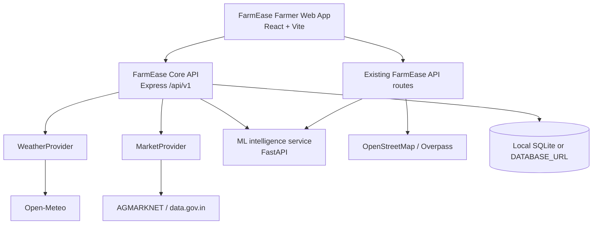

# FarmEase

## Open Agricultural Intelligence Infrastructure for India

> Build farmer applications without rebuilding agricultural infrastructure.

[](https://github.com/Rakshita-0023/Farmease/actions/workflows/ci.yml) [](LICENSE)

FarmEase is an open-source agricultural intelligence platform for India. It pairs a reference farmer application with a versioned Core API, normalized agricultural contracts, and extensible data providers for weather, markets, crop intelligence, and plant diagnosis.

There is no maintained public demo URL yet. Run the reference app locally using the quick start below.

## What exists today

- React farmer web app: authentication, farms, activities, weather, markets, crop recommendations, plant diagnosis, multilingual UI, and Kisan Charcha community features.
- Express backend with existing routes retained for compatibility and a normalized `/api/v1` surface, provider registry, request IDs, bounded retries, TTL cache, and structured provider events.
- Explainable `POST /api/v1/advisories` over canonical farm context and normalized weather, with explicit degraded states and citation-ready provenance.
- Open-Meteo weather provider; AGMARKNET/data.gov.in live market-price adapter when configured; and OpenStreetMap/Overpass market discovery in the existing app. IMD and eNAM are researched but are not implemented providers.
- FastAPI ML service with a crop model, rule-based crop fallback, and TensorFlow plant disease model.
- SQLite local development with PostgreSQL/MySQL support through `DATABASE_URL`.

The legacy market UI has an explicit `MARKET_DATA_MODE=DEMO` option for visual development. It is not used by FarmEase Core v1 and must not be presented as live market data.

## Architecture



FarmEase Platform / Core is the reusable API and provider layer. FarmEase Farmer Web App is the current reference client. `ml-service/` is an independently runnable intelligence service consumed by both.

## Repository structure

```text
frontend/              React reference farmer application
backend/               Express API, database setup, providers, tests
backend/routes/v1.js   Normalized FarmEase Core API
backend/schemas/       Reusable location, commodity, market-price, and farm contracts
backend/openapi/v1.js  OpenAPI 3.0 source for Core v1
ml-service/            FastAPI crop and plant intelligence service
docs/                  Domain contract and contribution backlog
```

## Quick start

Prerequisites: Node 20+ and Python 3.10–3.12 for TensorFlow compatibility.

```bash
git clone https://github.com/Rakshita-0023/Farmease.git
cd Farmease
cp backend/.env.example backend/.env
cp frontend/.env.example frontend/.env
cp ml-service/.env.example ml-service/.env
npm ci --prefix backend
npm ci --prefix frontend
npm --prefix backend run db:setup
python -m venv ml-service/.venv
ml-service/.venv/bin/pip install -r ml-service/requirements.txt
```

Run each service in a separate terminal:

```bash
npm run backend:dev
npm run frontend:dev
cd ml-service && .venv/bin/uvicorn app:app --reload --port 8000
```

Open `http://localhost:5173`. The Core Swagger UI is at `http://localhost:5001/api/v1/docs` and its machine-readable contract is at `/api/v1/openapi.json`. FastAPI interactive documentation is at `http://127.0.0.1:8000/docs`.

## Environment configuration

Copy each service’s `.env.example`; never commit the resulting `.env` files.

| Variable | Service | Required | Purpose |
| --- | --- | --- | --- |
| `JWT_SECRET` | backend | Yes | Signs application sessions; use a strong unique value. |
| `DATABASE_URL` | backend | No | PostgreSQL/MySQL production database; omit for local SQLite. |
| `ML_API_URL` | backend | No | Local/deployed FastAPI crop service. |
| `AGMARKNET_API_KEY` | backend | For live prices | data.gov.in key for the AGMARKNET provider. |
| `OPENWEATHER_API_KEY` | backend | No | Legacy weather/geocoding fallback only. |
| `GOOGLE_CLIENT_ID` / `VITE_GOOGLE_CLIENT_ID` | backend/frontend | No | Google sign-in. |
| `FARMEASE_CORS_ORIGINS` | ML | Production | Comma-separated browser origins. |

Open-Meteo needs no credential. Plant diagnosis and crop recommendation report a clear unavailable response when the ML service is not running; they do not invent confidence scores.

## FarmEase Core API

All `/api/v1` success responses use `{ "data": ..., "meta": { "provider", "timestamp", "requestId" } }`. Failures use `{ "error": { "code", "message", "details?" }, "meta": { "timestamp", "requestId" } }`. Send an optional safe `X-Request-Id` to correlate logs; every response sets that header. `meta.cache` is `hit` or `miss` for provider-backed responses.

```bash
curl http://localhost:5001/api/v1/health
curl http://localhost:5001/api/v1/providers
curl 'http://localhost:5001/api/v1/weather/current?lat=17.385&lon=78.4867'
curl 'http://localhost:5001/api/v1/weather/current?lat=17.385&lon=78.4867&provider=open-meteo'
curl 'http://localhost:5001/api/v1/weather/forecast?lat=17.385&lon=78.4867'
curl 'http://localhost:5001/api/v1/market-prices?state=Haryana&district=Karnal&commodity=wheat&limit=25&offset=0&provider=agmarknet'
curl -X POST http://localhost:5001/api/v1/advisories -H 'content-type: application/json' -d '{"farm":{"id":"farm-1","name":"North field","area":{"value":2,"unit":"acre"},"location":{"latitude":29.68,"longitude":76.99},"currentCrop":{"name":"wheat"}},"weather":{"temperatureC":36,"humidityPercent":72,"precipitationMm":0}}'
curl -X POST http://localhost:5001/api/v1/crop-recommendation -H 'content-type: application/json' -d '{"N":90,"P":42,"K":43,"temperature":20.87,"humidity":82,"ph":6.5,"rainfall":202.93}'
curl -X POST http://localhost:5001/api/v1/plant-diagnosis -F file=@leaf.jpg
```

`/api/v1/markets` and `/api/v1/market-prices` are aliases for normalized AGMARKNET price records. They return an empty array when a live query has no records and provider errors when AGMARKNET is unavailable or unconfigured; they never return simulated market data. The Core deliberately exposes prices, not an unverified market-directory dataset. See [the data schemas](docs/DATA_SCHEMAS.md) and [farm contract](docs/FARM_SCHEMA.md). For explainable farm signals, see [`POST /api/v1/advisories`](docs/ADVISORY_ENGINE.md).

## Providers and intelligence

| Domain | Implemented provider/service | Notes |
| --- | --- | --- |
| Weather | Open-Meteo | Normalized current weather and forecast. |
| Market prices | AGMARKNET / data.gov.in | Key-gated, normalized live price records. |
| Market discovery | OpenStreetMap/Overpass | Existing reference-app integration; public endpoint availability varies. |
| Crop recommendation | local FastAPI model / rules | No confidence for rule mode. |
| Plant diagnosis | local TensorFlow model | Valid image required; confidence is model-derived. |

Read the [provider development guide](docs/PROVIDER_DEVELOPMENT.md) before adding an adapter. IMD and eNAM research is documented in [docs/providers/imd.md](docs/providers/imd.md) and [docs/providers/enam.md](docs/providers/enam.md); future Sentinel, NASA POWER, OpenAgriNet, and AgriStack work belongs in [ROADMAP.md](ROADMAP.md), not the implemented-provider list.

## Models

The repo contains `crop_model.pkl` (~3.4 MB) and `disease_model.h5` (~11 MB) because the local service currently needs them. See [the model notes](ml-service/MODEL_CARD.md). Future releases should use versioned model artifacts with integrity checks rather than growing Git history indefinitely.

## Testing

```bash
npm --prefix backend test
npm --prefix backend run openapi:validate
npm --prefix frontend test
npm --prefix frontend run lint
npm --prefix frontend run build
cd ml-service && FARMEASE_SKIP_MODEL_LOADING=true .venv/bin/python -m unittest discover -s tests
```

Backend tests build an ignored SQLite test database from migrations. External-provider tests should mock upstream requests rather than call the network.

## Contributing, security, and license

Read [CONTRIBUTING.md](CONTRIBUTING.md), [CODE_OF_CONDUCT.md](CODE_OF_CONDUCT.md), [SECURITY.md](SECURITY.md), and the [contribution backlog](docs/CONTRIBUTION_BACKLOG.md). FarmEase is released under the [Apache License 2.0](LICENSE).

## Developer ecosystem

FarmEase ships a dependency-light Python SDK (`sdks/python`, version 0.1.0) and a typed TypeScript SDK (`sdks/typescript`, version 0.1.0). See [SDK getting started](docs/SDK_GETTING_STARTED.md) and runnable examples in `examples/python/`.

Packages are release-ready but not yet published. For local development use `python3 -m pip install -e sdks/python` or build the wheel; for TypeScript use `npm install ./sdks/typescript` after `npm run build`. Published install commands will be added after the first maintainer release.

```python
from farmease import FarmEase
client = FarmEase("http://localhost:5000/api/v1")
print(client.weather.current(lat=28.6, lon=77.2))
```

```ts
const client = new FarmEase({ baseUrl: "http://localhost:5000/api/v1" });
const prices = await client.markets.prices({ commodity: "wheat" });
```

Phase 4 adds the geospatial and alert foundation: validated farm GeoJSON boundaries, a Sentinel-2 provider contract with explicit unavailable behavior until authorized Process API configuration, normalized vegetation metrics, field-health APIs, and deterministic threshold alerts. See [GEOSPATIAL.md](docs/GEOSPATIAL.md) and [ALERT_ENGINE.md](docs/ALERT_ENGINE.md).

### Geospatial and alerts

`GET /api/v1/farms/:id/field-health` returns normalized observations when a configured satellite provider can provide them; otherwise it returns a predictable provider-unavailable error. `POST /api/v1/alert-rules`, `POST /api/v1/farms/:id/alerts/evaluate`, and `GET /api/v1/farms/:id/alerts` provide deterministic, source-labelled alerts. Vegetation changes are stress signals only, never disease diagnoses.

See the staged [ROADMAP.md](ROADMAP.md) for India agricultural data, intelligence, geospatial features, and an SDK ecosystem.
