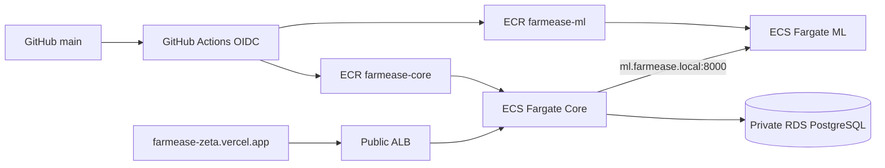

# FarmEase AWS deployment

This is the AWS migration path for the released FarmEase application. Vercel
remains the frontend host at `https://farmease-zeta.vercel.app/`; Render remains
the fallback until the AWS endpoint passes the complete smoke test.

## Architecture



The initial implementation uses two public subnets across two Availability
Zones for the ALB and Fargate ENIs. Task security groups allow inbound traffic
only from the ALB (Core) or Core (ML); task public IPs are used only for
outbound ECR/provider access, avoiding a NAT Gateway's fixed cost. RDS is in
isolated database subnets and accepts port 5432 only from Core.

## Files

- `backend/Dockerfile`: Core image
- `ml-service/Dockerfile`: FastAPI/ML image, Python 3.11.11
- `docker-compose.yml`: local Core/ML/PostgreSQL stack
- `infra/aws/`: VPC, ALB, ECS, ECR, RDS, Cloud Map, IAM, OIDC, logs
- `infra/aws/bootstrap/`: one-time encrypted/versioned S3 state bucket
- `.github/workflows/ci.yml`: tests, image builds, Terraform validation
- `.github/workflows/deploy-aws.yml`: OIDC image push and ECS rolling deploy
- `.github/workflows/infra-aws.yml`: protected manual Terraform plan/apply

## Prerequisites

Use an authenticated temporary AWS session in `ap-south-1` and configure GitHub
repository/environment variables without committing values:

- `AWS_DEPLOY_ROLE_ARN`
- `AWS_TERRAFORM_ROLE_ARN` (separate protected provisioning role)
- `AWS_REGION` (default `ap-south-1`)
- `AWS_CORE_URL` after the ALB exists
- `TF_STATE_BUCKET`
- `CORE_IMAGE`, `ML_IMAGE`, and `JWT_SECRET_ARN` for the protected infra workflow
- `AWS_TERRAFORM_ROLE_ARN` for the protected infrastructure workflow; this is
  intentionally separate from `AWS_DEPLOY_ROLE_ARN`, which only pushes images
  and updates ECS services

Create a Secrets Manager value for `JWT_SECRET`. Optional AGMARKNET, Google, and
Sentinel values are separate secrets. Terraform uses RDS-managed master
credentials and injects the JSON `username`/`password` fields into Core.

## Bootstrap and apply

```bash
cp infra/aws/bootstrap/terraform.tfvars.example infra/aws/bootstrap/terraform.tfvars
# edit the ignored file with a globally unique state bucket name
terraform -chdir=infra/aws/bootstrap init
terraform -chdir=infra/aws/bootstrap apply

cp infra/aws/terraform.tfvars.example infra/aws/terraform.tfvars
# edit image URIs and secret ARNs; never commit this file
terraform -chdir=infra/aws init \
  -backend-config="bucket=<state-bucket>" \
  -backend-config="key=farmease/production.tfstate" \
  -backend-config="region=ap-south-1" \
  -backend-config="encrypt=true" \
  -backend-config="use_lockfile=true"
terraform -chdir=infra/aws plan
terraform -chdir=infra/aws apply
```

The first apply creates ECR repositories, then images can be built and pushed;
provide immutable SHA image URIs in the variables and apply again. The ECS
deployment circuit breaker rolls back tasks that fail ALB/container health.

## Migrations

Run the idempotent migration command as an ECS one-off task using the Core image
and its task networking/secrets before a schema-dependent rollout:

```bash
npm run db:migrate
```

It issues only `CREATE TABLE IF NOT EXISTS` statements. It never drops,
truncates, or automatically rewrites data. The service startup compatibility
path remains non-destructive. Roll back application images independently; any
future incompatible schema migration must be expanded/contracted manually.

## HTTPS and rollback

The ALB is HTTP-only until an owned DNS name and ACM certificate are supplied.
Set `enable_https=true` and `acm_certificate_arn` to enable HTTPS plus HTTP
redirect. Do not invent a domain or certificate. Select the prior ECS task
definition revision and update the service to roll back manually if required.

## Cost review

Recurring components are Fargate task-hours, the ALB hourly/LCU usage charge,
RDS instance/storage/backups, CloudWatch log storage/ingestion, and ECR storage.
There is no NAT Gateway, EKS, multi-region copy, cache, or service mesh. The
small default Core task is 0.5 vCPU/1 GB; ML is 1 vCPU/4 GB because TensorFlow
can exceed Core's footprint. Actual cost depends on region, uptime, traffic,
storage, and AWS pricing; this repository does not claim an exact bill.
